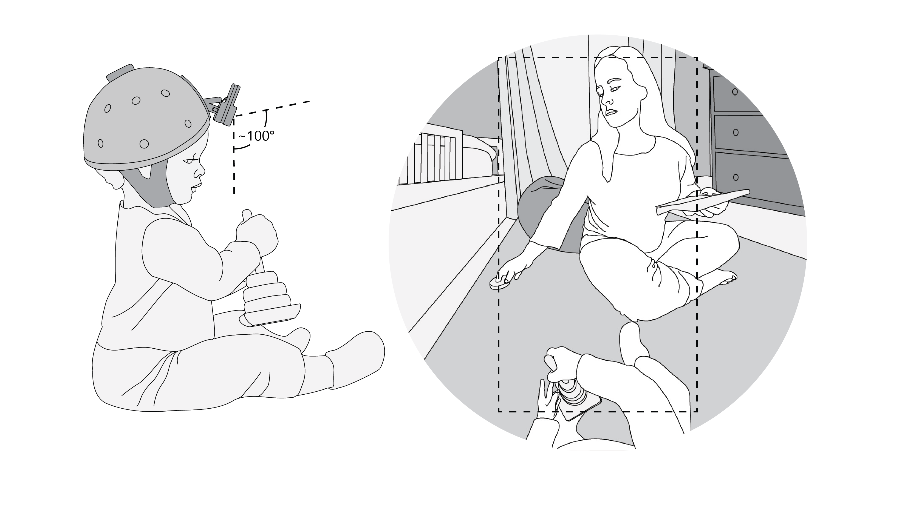

## About the BabyView

The BabyView camera is designed collect high-resolution, at-home egocentric video data from children 9 - 30 months of age.  The camera consists a rotated  GoPro Black Bones camera attached to a lightweight baby safety helmet using a custom 3D printed mount and attached to a rechargeable 9V battery. The BabyView camera was designed in collaboration with Daylight, Inc., a product-design firm in San Francisco, CA, and and is the result of more than a year of prototyping.

## Materials 

All design documentation, safety testing protocols, assembly instructions, pilot data, data management protocols, and sample participant instructions can be found at https://osf.io/kwvxu/.

## Contact and Acknowledgements

Contributors: 

Bria Long1, Sarah Goodin2, George Kachergis1, Virginia A. Marchman1, Samaher Radwan1, 
Violet Xiang1, Chengxu Zhuang1, Oliver Hsu2, Brett Newman2, Daniel L. K. Yamins1,3, Michael C. Frank 1

1 Department of Psychology, Stanford University
2 Daylight Design
3 Department of Computer Science, Stanford University

Research and development of the BabyView was supported by a generous gift from The Schmidt Futures Foundation (https://www.schmidtfutures.com/).

For more information, contact [Michael Frank](http://web.stanford.edu/~mcfrank/).

## License

 This work is licensed under a <a rel="license" href="http://creativecommons.org/licenses/by/4.0/">Creative Commons Attribution 4.0 International License</a>. It can be shared and adapted, but you must acknowledge the original by citing the paper above. 
